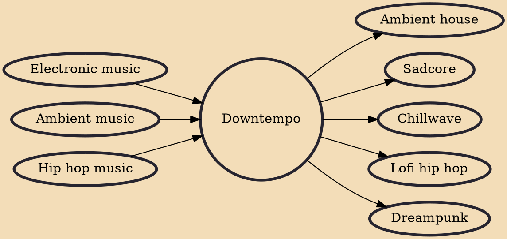

Downtempo (or downbeat) is a broad label for electronic music that features an atmospheric sound and slower beats than would typically be found in dance music. Closely related to ambient music but with greater emphasis on rhythm, the style may be played in chillout clubs or as "warm-up or cool-down" music during a DJ set. Examples of downtempo subgenres include trip hop, ambient house, chillwave, psybient and lo-fi hip hop.

## Influences

- [[Electronic music]]
- [[Ambient music]]
- [[Hip hop music]]

## Derivatives

- [[Ambient house]]
- [[Sadcore]]
- [[Chillwave]]
- [[Lofi hip hop]]
- [[Dreampunk]]
