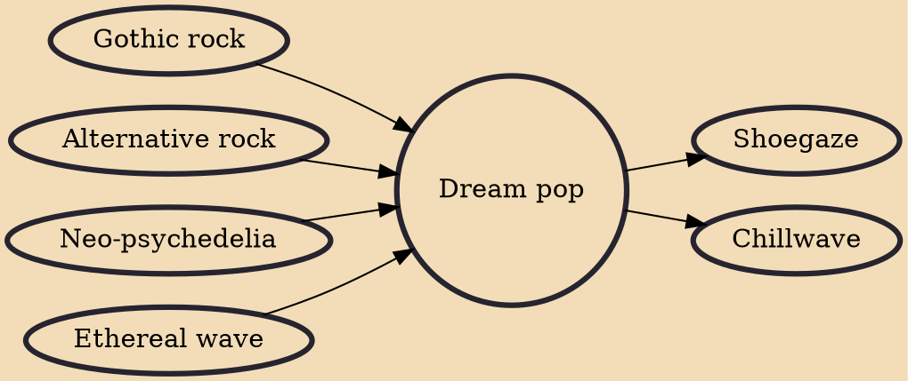

Dream pop (also typeset as dreampop) is a subgenre of alternative rock and neo-psychedelia that emphasizes atmosphere and sonic texture as much as pop melody. Common characteristics include breathy vocals, dense productions, and effects such as reverb, echo, tremolo, and chorus. It often overlaps with the related genre of shoegaze, and the two genre terms have at times been used interchangeably.

## Influences

- [[Gothic rock]]
- [[Alternative rock]]
- [[Neo-psychedelia]]
- [[Ethereal wave]]

## Derivatives

- [[Shoegaze]]
- [[Chillwave]]
