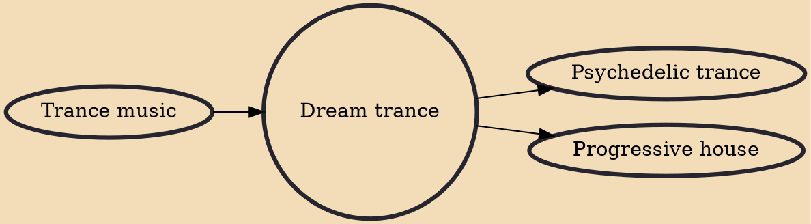

Dream trance is an early subgenre of trance music that peaked prominently on the international dance scene between 1995 and 1998 (colliding with the first time for trance to reach mainstream). The "dream" term has been known to largely influence house music in general, and therefore the subgenre is also known as dream house or dream dance on some occasions.

## Influences
- [[Trance music]]

## Derivatives
- [[Psychedelic trance]]
- [[Progressive house]]
