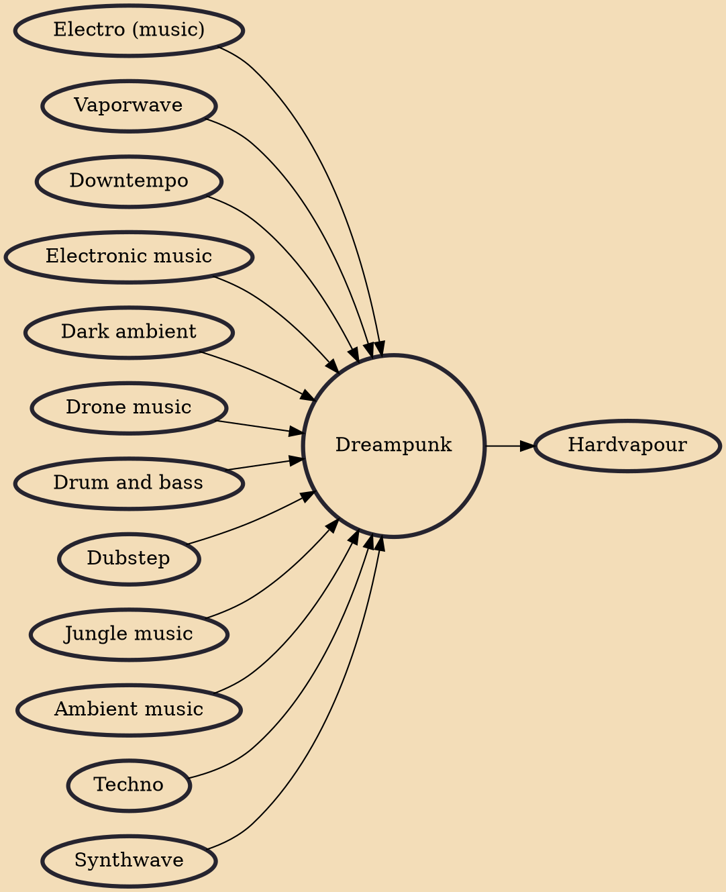

Dreampunk is a microgenre of electronic music characterized by its focus on cinematic ambience and field recordings, combined with various traits and techniques from electronic genres such as techno, jungle, electro, and dubstep.

## Influences
- [[Electro (music)]]
- [[Vaporwave]]
- [[Downtempo]]
- [[Electronic music]]
- [[Dark ambient]]
- [[Drone music]]
- [[Drum and bass]]
- [[Dubstep]]
- [[Jungle music]]
- [[Ambient music]]
- [[Techno]]
- [[Synthwave]]

## Derivatives
- [[Hardvapour]]
