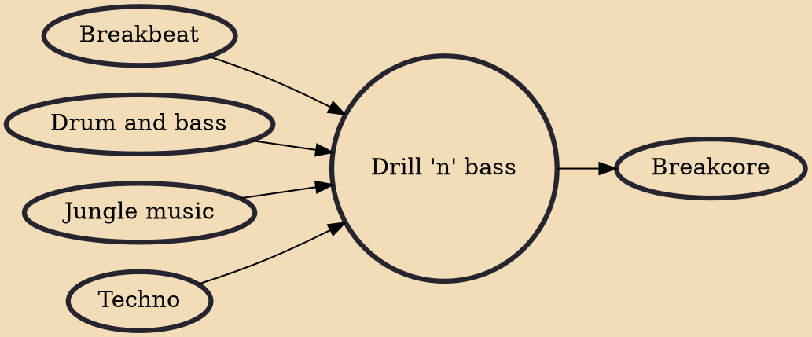

Drill 'n' bass is a subgenre of drum and bass which developed in the mid-1990s as IDM artists began experimenting with elements of breakbeat, jungle, and drum and bass music. Artists utilized powerful audio software programs and deployed frenzied, irregular beats that often discouraged dancing. The style was often interpreted as having a lightly parodic relationship with the dance styles that inspired it.

## Influences
- [[Breakbeat]]
- [[Drum and bass]]
- [[Jungle music]]
- [[Techno]]

## Derivatives
- [[Breakcore]]
