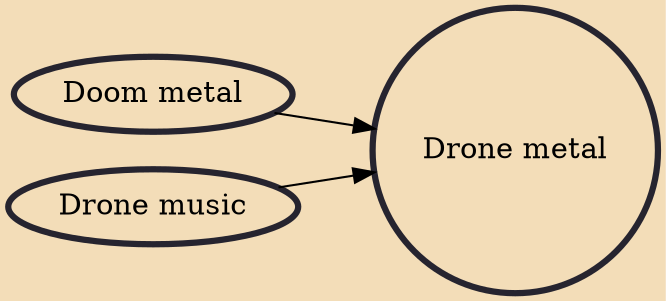

Drone metal or drone doom is a style of heavy metal that melds the slow tempos and heaviness of doom metal with the long-duration tones of drone music. Drone metal is sometimes associated with post-metal or experimental metal.

## Influences
- [[Doom metal]]
- [[Drone music]]
