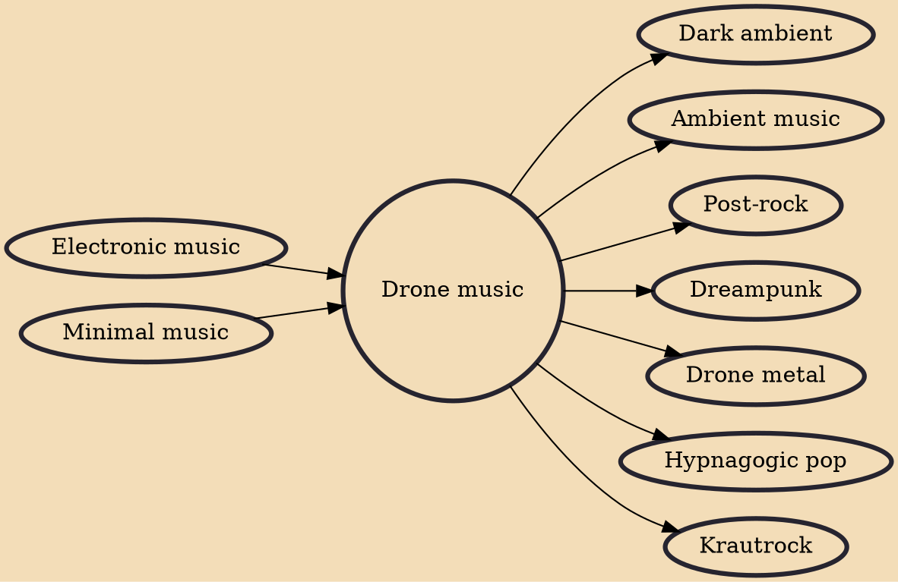

Drone music, drone-based music, or simply drone, is a minimalist genre that emphasizes the use of sustained sounds, notes, or tone clusters – called drones. It is typically characterized by lengthy audio programs with relatively slight harmonic variations throughout each piece. La Monte Young, one of its 1960s originators, defined it in 2000 as "the sustained tone branch of minimalism".

## Influences

- [[Electronic music]]
- [[Minimal music]]

## Derivatives

- [[Dark ambient]]
- [[Ambient music]]
- [[Post-rock]]
- [[Dreampunk]]
- [[Drone metal]]
- [[Hypnagogic pop]]
- [[Krautrock]]
