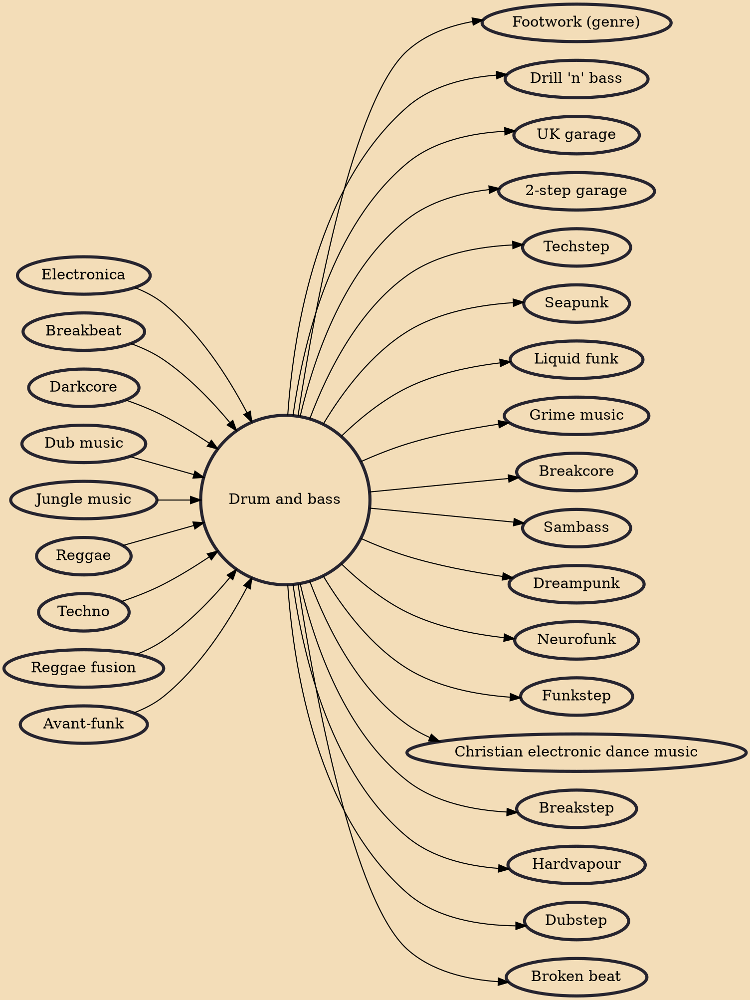

Drum and bass (also written as drum & bass or drum'n'bass and commonly abbreviated as D&B, DnB, or D'n'B) is a genre of electronic dance music characterized by fast breakbeats (typically 165–185 beats per minute) with heavy bass and sub-bass lines, samples, and synthesizers. The genre grew out of the UK's rave scene in the 1990s.

## Influences
- [[Electronica]]
- [[Breakbeat]]
- [[Darkcore]]
- [[Dub music]]
- [[Jungle music]]
- [[Reggae]]
- [[Techno]]
- [[Reggae fusion]]
- [[Avant-funk]]

## Derivatives
- [[Footwork (genre)]]
- [[Drill 'n' bass]]
- [[UK garage]]
- [[2-step garage]]
- [[Techstep]]
- [[Seapunk]]
- [[Liquid funk]]
- [[Grime music]]
- [[Breakcore]]
- [[Sambass]]
- [[Dreampunk]]
- [[Neurofunk]]
- [[Funkstep]]
- [[Christian electronic dance music]]
- [[Breakstep]]
- [[Hardvapour]]
- [[Dubstep]]
- [[Broken beat]]
