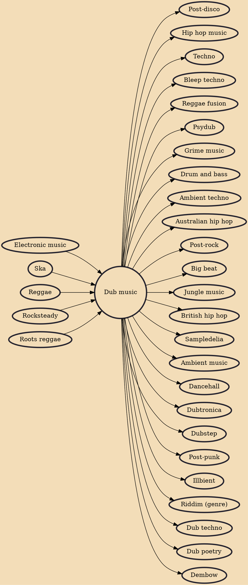

Dub is an electronic musical style that grew out of reggae in the late 1960s and early 1970s. It is commonly considered a subgenre of reggae, though it has developed to extend beyond that style. Generally, dub consists of remixes of existing recordings created by significantly manipulating the original, usually through the removal of vocal parts, the application of studio effects such as echo and reverb, emphasis of the rhythm section (the stripped-down drum-and-bass track is sometimes referred to as a riddim), and the occasional dubbing of vocal or instrumental snippets from the original version or other works.

## Influences

- [[Electronic music]]
- [[Ska]]
- [[Reggae]]
- [[Rocksteady]]
- [[Roots reggae]]

## Derivatives

- [[Post-disco]]
- [[Hip hop music]]
- [[Techno]]
- [[Bleep techno]]
- [[Reggae fusion]]
- [[Psydub]]
- [[Grime music]]
- [[Drum and bass]]
- [[Ambient techno]]
- [[Australian hip hop]]
- [[Post-rock]]
- [[Big beat]]
- [[Jungle music]]
- [[British hip hop]]
- [[Sampledelia]]
- [[Ambient music]]
- [[Dancehall]]
- [[Dubtronica]]
- [[Dubstep]]
- [[Post-punk]]
- [[Illbient]]
- [[Riddim (genre)]]
- [[Dub techno]]
- [[Dub poetry]]
- [[Dembow]]
