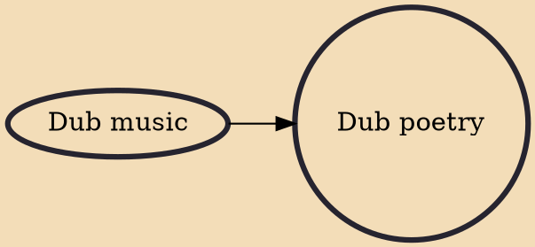

Dub poetry is a form of performance poetry of West Indian origin, which evolved out of dub music in Kingston, Jamaica, in the 1970s, as well as in London, England and Toronto, Canada, cities which have large populations of Caribbean immigrants. The term "Dub Poetry" was coined by Dub artist Linton Kwesi Johnson in 1976, and further popularized by artist Oku Onoura, which consists of spoken word over reggae rhythms, originally found on the backing or "version" side of a 12 or 6 inch vinyl record.

## Influences

- [[Dub music]]
