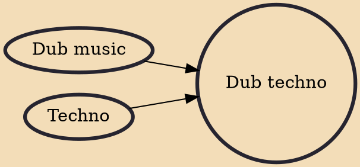

```dot
digraph {
	graph [bgcolor="#F3DDB8" rankdir=LR]
	node [color="#26242F" penwidth=3.0]
	"Dub techno" [shape=circle]
	"Dub music" [URL="/dub-music/"]
	"Dub music" -> "Dub techno"
	Techno [URL="/techno/"]
	Techno -> "Dub techno"
}
```

Dub techno is a subgenre of techno that combines the style with elements of dub music, including its sparse, delay-heavy production and prominent bass.

## Influences

- [[Dub music]]
- [[Techno]]
