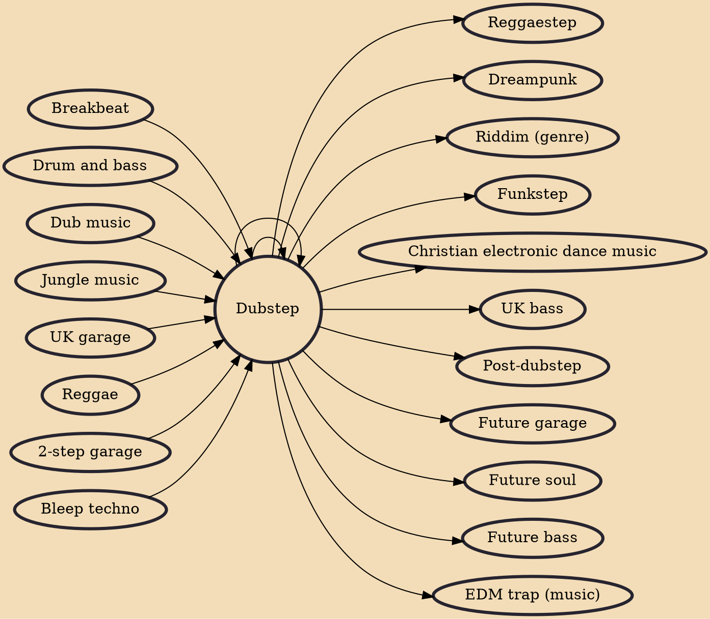

Dubstep is a genre of electronic dance music that originated in South London in the early 2000s. The style emerged as a UK garage offshoot that blended 2-step rhythms and sparse dub production, as well as incorporating elements of broken beat, grime, and drum and bass. In the United Kingdom, the origins of the genre can be traced back to the growth of the Jamaican sound system party scene in the early 1980s.

## Influences
- [[Breakbeat]]
- [[Drum and bass]]
- [[Dub music]]
- [[Dubstep]]
- [[Jungle music]]
- [[UK garage]]
- [[Reggae]]
- [[2-step garage]]
- [[Bleep techno]]

## Derivatives
- [[Reggaestep]]
- [[Dreampunk]]
- [[Riddim (genre)]]
- [[Funkstep]]
- [[Christian electronic dance music]]
- [[UK bass]]
- [[Post-dubstep]]
- [[Dubstep]]
- [[Future garage]]
- [[Future soul]]
- [[Future bass]]
- [[EDM trap (music)]]
