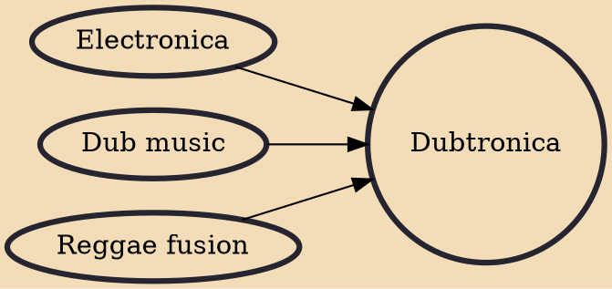

Dubtronica is electronic music influenced by dub music. Early examples from the 1980s are the experimental English dub of On-U Sound Records and Mad Professor. It is also called simply "dub" or "techdub". Dubtronica consists of electronic beats played in a downbeat manner. It is much lower in speed than techno and generally warmer than dance-oriented electronica. Some tracks use reggae toasters or singers to produce a more accessible form of the music.

## Influences

- [[Electronica]]
- [[Dub music]]
- [[Reggae fusion]]
