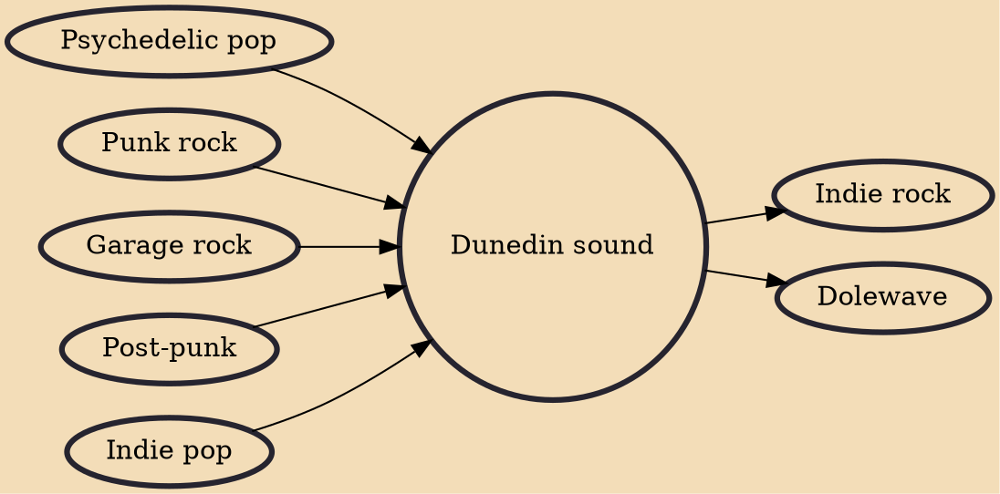

The Dunedin sound was a style of indie pop music created in the southern New Zealand university city of Dunedin in the early 1980s.

## Influences
- [[Psychedelic pop]]
- [[Punk rock]]
- [[Garage rock]]
- [[Post-punk]]
- [[Indie pop]]

## Derivatives
- [[Indie rock]]
- [[Dolewave]]
