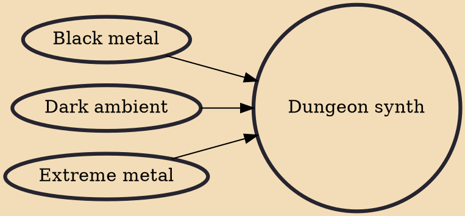

Dungeon synth is a genre of electronic music that merges elements of black metal and dark ambient. The style emerged in the early 1990s, predominantly among members of the black metal scene, such as Mortiis, Burzum, Robert Fudali of Lord Wind and Graveland, Tomi Kalliola of Azaghal and Valar, Sigurd Wongraven of Wongraven and Satyricon, Andreas Bettinger of Grausamkeit, Silenius and Protector of Summoning, Die Verbannten Kinder Evas, Abigor, Pazuzu, and Grabesmond, Ray Heflin of Absu, and Equitant, among others.

## Influences

- [[Black metal]]
- [[Dark ambient]]
- [[Extreme metal]]
