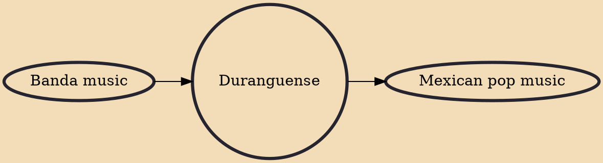

Duranguense is a genre of Regional Mexican music. It is a hybrid of Technobanda and Tamborazo. Its popularity peaked in the mid to late 2000s among the Mexican and Mexican American community in the United States, as well as in many parts of Mexico. The instruments held over from tamborazo are the saxophone, trombone, and tambora, while the instruments held over from technobanda are the electronic keyboard (more specifically the Korg X3, Korg N364, which are used for the main melody and the Yamaha DX7, which is used by many bands for the bass section), drum set, and vocals. The electronic keyboard is emphasized in Duranguense, giving the genre its own signature riff. The genre popularized the dance style, Pasito Duranguense.

## Influences
- [[Banda music]]

## Derivatives
- [[Mexican pop music]]
