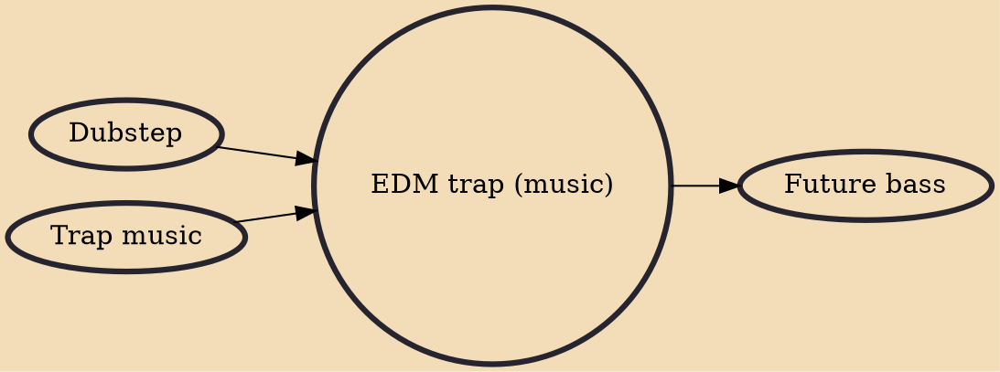

EDM trap is a fusion genre of hip hop, rave music and EDM, that originated in the early 2010s on peaking popularity of big room house and trap music genres. It blends elements of trap, which is an offshoot of Southern hip hop, with elements of electronic dance music like build-ups, drops, and breakdowns. A variety of artists spurred trap's move into pop and EDM.

## Influences

- [[Dubstep]]
- [[Trap music]]

## Derivatives

- [[Future bass]]
