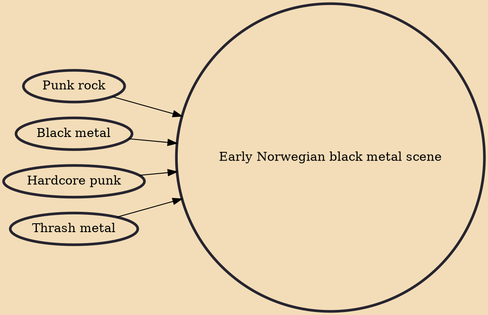

The early Norwegian black metal scene of the 1990s is credited with creating the modern black metal genre and produced some of the most acclaimed and influential artists in extreme metal. It attracted massive media attention when it was revealed that its members had been responsible for two murders and a wave of church burnings in Norway.

## Influences
- [[Punk rock]]
- [[Black metal]]
- [[Hardcore punk]]
- [[Thrash metal]]
