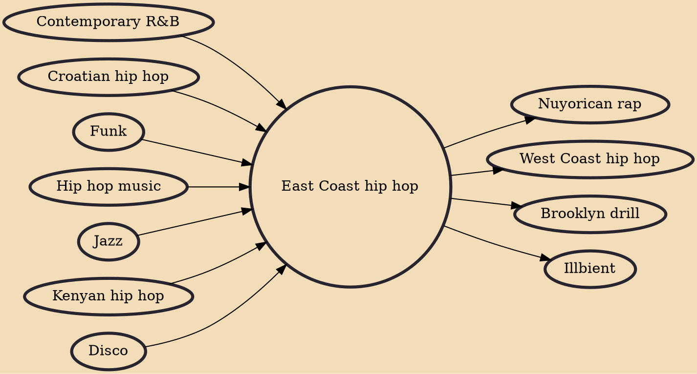

East Coast hip hop is a regional subgenre of hip hop music that originated in New York City during the 1970s. Hip hop is recognized to have originated and evolved first in the Bronx, New York City. In contrast to other styles, East Coast hip hop music has prioritized complex lyrics for attentive listening rather than beats for dancing. The term "East Coast hip hop" more specifically denotes hip hop originating from the East Coast of the Northeastern United States; Southeastern states such as Georgia instead fall under the umbrella of Southern hip hop rather than "East Coast hip hop". A notable exception is the Hampton Roads music scene, centered on Virginia Beach, which produced artists as diverse as Missy Elliott, Pharrell and the Neptunes, Timbaland and the Clipse, all of whom are closel

## Influences

- [[Contemporary R&B]]
- [[Croatian hip hop]]
- [[Funk]]
- [[Hip hop music]]
- [[Jazz]]
- [[Kenyan hip hop]]
- [[Disco]]

## Derivatives

- [[Nuyorican rap]]
- [[West Coast hip hop]]
- [[Brooklyn drill]]
- [[Illbient]]
