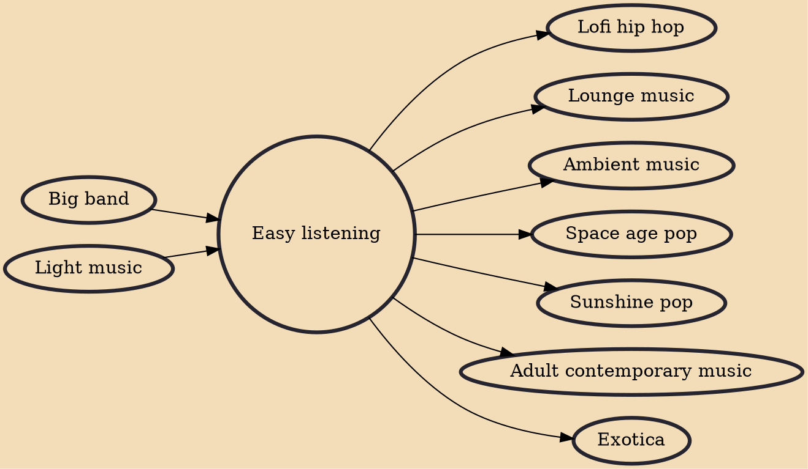

Easy listening (including mood music) is a popular music genre and radio format that was most popular during the 1950s to 1970s. It is related to middle-of-the-road (MOR) music and encompasses instrumental recordings of standards, hit songs, non-rock vocals and instrumental covers of selected popular rock songs. It mostly concentrates on music that pre-dates the rock and roll era, characteristically on music from the 1940s and 1950s. It was differentiated from the mostly instrumental beautiful music format by its variety of styles, including a percentage of vocals, arrangements and tempos to fit various parts of the broadcast day.

## Influences

- [[Big band]]
- [[Light music]]

## Derivatives

- [[Lofi hip hop]]
- [[Lounge music]]
- [[Ambient music]]
- [[Space age pop]]
- [[Sunshine pop]]
- [[Adult contemporary music]]
- [[Exotica]]
