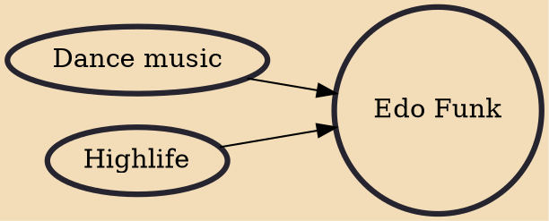

Edo funk is a musical style from Benin City, Edo State, created in the early 1970s. The Edo Funk music genre is a cosmopolitan popular dance music with integrating elements from the native Edo culture and fusing them with new sound effects coming from West Africa night-clubs. Edo Funk's pioneers and best known exponent is Victor Uwaifo, who has released a series of Edo Funk album recordings starting in the 1970s with other Edo musicians such as , Osayomore Joseph, Ukodo, and . and Akwete were also the sub genres of Edo Funk, to interpret the traditional Benin sound.

## Influences
- [[Dance music]]
- [[Highlife]]
