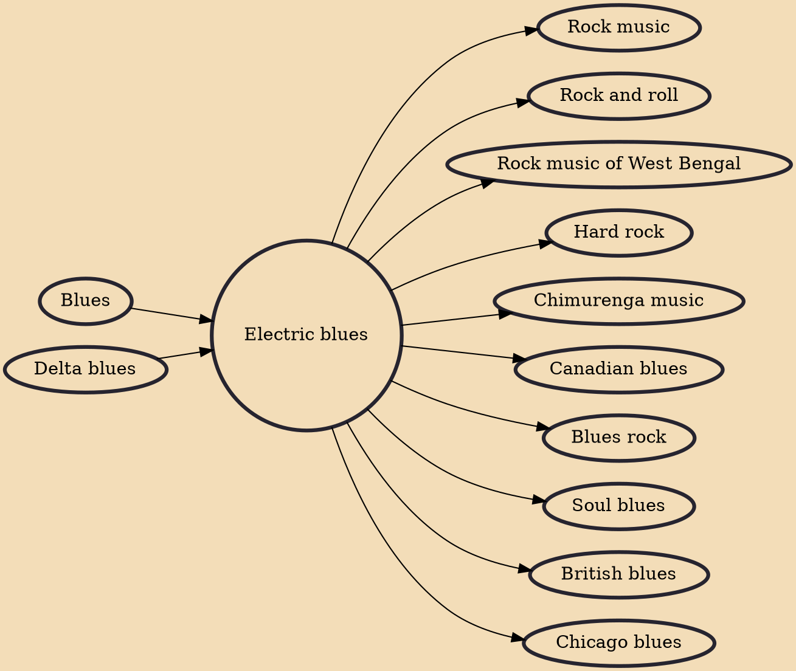

Electric blues refers to any type of blues music distinguished by the use of electric amplification for musical instruments. The guitar was the first instrument to be popularly amplified and used by early pioneers T-Bone Walker in the late 1930s and John Lee Hooker and Muddy Waters in the 1940s. Their styles developed into West Coast blues, Detroit blues, and post-World War II Chicago blues, which differed from earlier, predominantly acoustic-style blues. By the early 1950s, Little Walter was a featured soloist on blues harmonica using a small hand-held microphone fed into a guitar amplifier. Although it took a little longer, the electric bass guitar gradually replaced the stand-up bass by the early 1960s. Electric organs and especially keyboards later became widely used in electric blues.

## Influences

- [[Blues]]
- [[Delta blues]]

## Derivatives

- [[Rock music]]
- [[Rock and roll]]
- [[Rock music of West Bengal]]
- [[Hard rock]]
- [[Chimurenga music]]
- [[Canadian blues]]
- [[Blues rock]]
- [[Soul blues]]
- [[British blues]]
- [[Chicago blues]]
