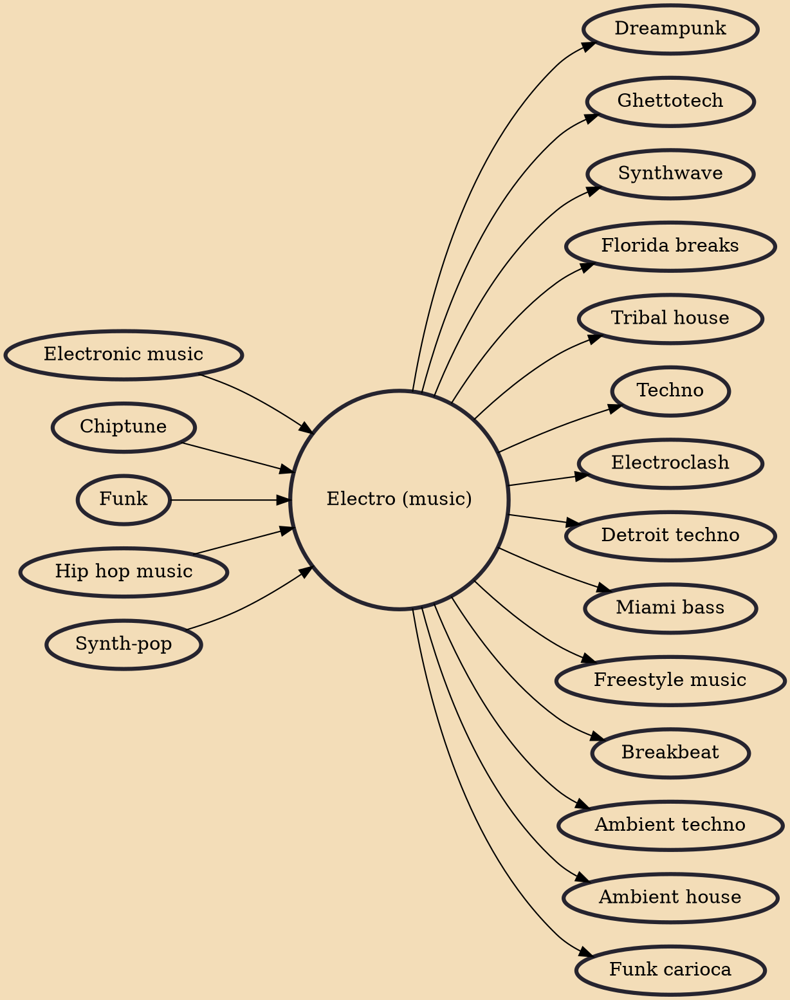

Electro (or electro-funk) is a genre of electronic music and early hip hop directly influenced by the use of the Roland TR-808 drum machines, and funk. Records in the genre typically feature drum machines and heavy electronic sounds, usually without vocals, although if vocals are present they are delivered in a deadpan manner, often through electronic distortion such as vocoding and talkboxing. This is the main distinction between electro and previously prominent genres such as disco, in which the electronic sound was only part of the instrumentation. It also palpably deviates from its predecessor boogie for being less vocal-oriented and more focused on electronic beats produced by drum machines.

## Influences
- [[Electronic music]]
- [[Chiptune]]
- [[Funk]]
- [[Hip hop music]]
- [[Synth-pop]]

## Derivatives
- [[Dreampunk]]
- [[Ghettotech]]
- [[Synthwave]]
- [[Florida breaks]]
- [[Tribal house]]
- [[Techno]]
- [[Electroclash]]
- [[Detroit techno]]
- [[Miami bass]]
- [[Freestyle music]]
- [[Breakbeat]]
- [[Ambient techno]]
- [[Ambient house]]
- [[Funk carioca]]
