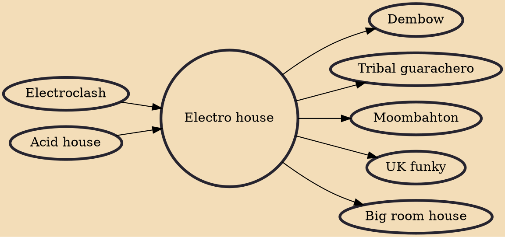

Electro house is a genre of electronic dance music characterized by heavy bass and a tempo around 130 beats per minute. The term has been used to describe the music of many DJ Mag Top 100 DJs, including Benny Benassi, Skrillex, Steve Aoki & Deadmau5.

## Influences
- [[Electroclash]]
- [[Acid house]]

## Derivatives
- [[Dembow]]
- [[Tribal guarachero]]
- [[Moombahton]]
- [[UK funky]]
- [[Big room house]]
