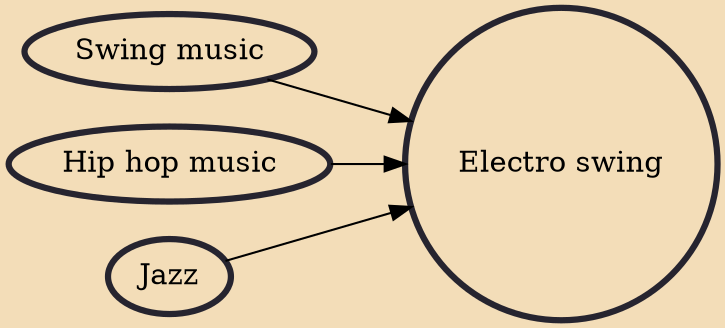

Electro swing, or swing house, is an electronic dance music genre that combines the influence of vintage or modern swing and jazz mixed with house and hip hop. Successful examples of the genre create a modern and dance-floor focused sound that is more readily accessible to the modern ear, but that also retains the energetic excitement of live brass and early swing recordings. Electro swing groups typically include singers, musicians playing traditional jazz instruments (e.g. trumpet, trombone, clarinet, saxophone) and at least one DJ.

## Influences

- [[Swing music]]
- [[Hip hop music]]
- [[Jazz]]
