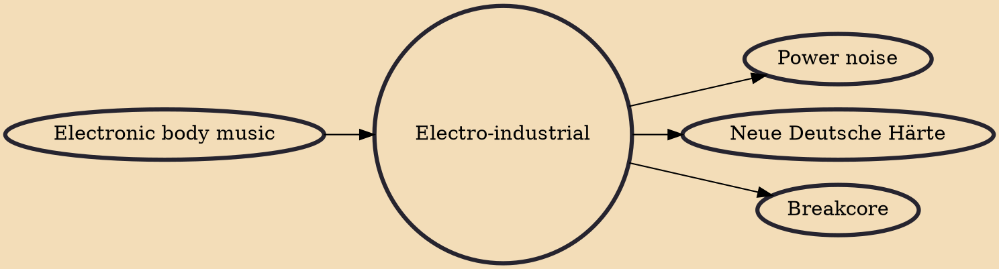

Electro-industrial is a music genre that emerged from industrial music in the early 1980s. While EBM (electronic body music) has a minimal structure and clean production, electro-industrial tends to have a grittier, complex and layered sound with a more experimental approach. The style was pioneered by Skinny Puppy, Front Line Assembly, Numb, and other groups, either from Canada or the Benelux. In the early 1990s, the style spawned the dark electro genre, and in the mid-/late-1990s, the aggrotech offshoot. The fan base for the style is linked to the rivethead subculture.

## Influences

- [[Electronic body music]]

## Derivatives

- [[Power noise]]
- [[Neue Deutsche Härte]]
- [[Breakcore]]
