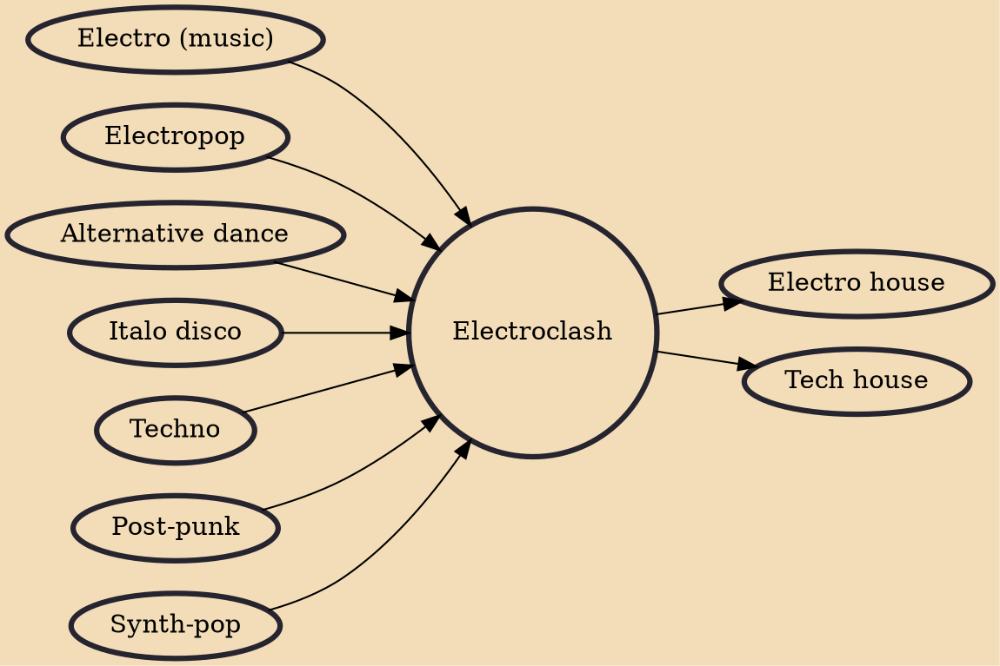

Electroclash (also known as synthcore, retro-electro, tech-pop, nouveau disco, and the new new wave) is a genre of music that fuses 1980s electro, new wave and synth-pop with 1990s techno, retro-style electropop and electronic dance music. It emerged in the later 1990s and is often thought of as reaching its peak circa 2002/2003. It was pioneered by and associated with acts such as I-F, DJ Hell, Miss Kittin and The Hacker, and Fischerspooner.

## Influences
- [[Electro (music)]]
- [[Electropop]]
- [[Alternative dance]]
- [[Italo disco]]
- [[Techno]]
- [[Post-punk]]
- [[Synth-pop]]

## Derivatives
- [[Electro house]]
- [[Tech house]]
