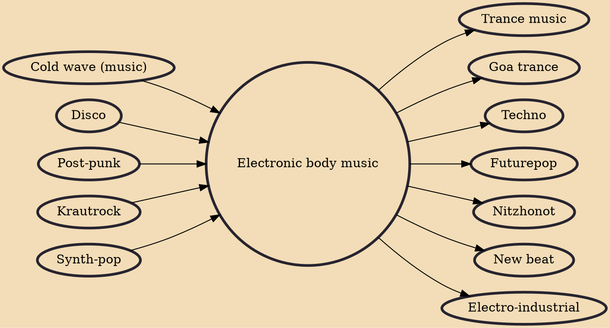

Electronic body music (acronymized to EBM) is a genre of electronic music that combines elements of industrial music and synth-punk with elements of disco and dance music. It developed in the early 1980s in Western Europe as an outgrowth of both punk and industrial music cultures. It combines sequenced repetitive basslines, programmed dance music rhythms, and mostly undistorted vocals and commandlike shouts with confrontational or provocative themes.

## Influences
- [[Cold wave (music)]]
- [[Disco]]
- [[Post-punk]]
- [[Krautrock]]
- [[Synth-pop]]

## Derivatives
- [[Trance music]]
- [[Goa trance]]
- [[Techno]]
- [[Futurepop]]
- [[Nitzhonot]]
- [[New beat]]
- [[Electro-industrial]]
