```dot
digraph {
	graph [bgcolor="#F3DDB8" rankdir=LR]
	node [color="#26242F" penwidth=3.0]
	"Electronic music" [shape=circle]
	Krautrock [URL="/krautrock/"]
	"Electronic music" -> Krautrock
	"Post-progressive" [URL="/post-progressive/"]
	"Electronic music" -> "Post-progressive"
	"Post-punk" [URL="/post-punk/"]
	"Electronic music" -> "Post-punk"
	"Mashup (music)" [URL="/mashup-music/"]
	"Electronic music" -> "Mashup (music)"
	"Post-disco" [URL="/post-disco/"]
	"Electronic music" -> "Post-disco"
	"Hypnagogic pop" [URL="/hypnagogic-pop/"]
	"Electronic music" -> "Hypnagogic pop"
	"Ethnic electronica" [URL="/ethnic-electronica/"]
	"Electronic music" -> "Ethnic electronica"
	"Cold wave (music)" [URL="/cold-wave-music/"]
	"Electronic music" -> "Cold wave (music)"
	"Geek rock" [URL="/geek-rock/"]
	"Electronic music" -> "Geek rock"
	"Visual kei" [URL="/visual-kei/"]
	"Electronic music" -> "Visual kei"
	"Noise music" [URL="/noise-music/"]
	"Electronic music" -> "Noise music"
	Ragga [URL="/ragga/"]
	"Electronic music" -> Ragga
	"Contemporary R&B" [URL="/contemporary-rb/"]
	"Electronic music" -> "Contemporary R&B"
	Sampledelia [URL="/sampledelia/"]
	"Electronic music" -> Sampledelia
	"Thai pop music" [URL="/thai-pop-music/"]
	"Electronic music" -> "Thai pop music"
	Electronicore [URL="/electronicore/"]
	"Electronic music" -> Electronicore
	"Shangaan electro" [URL="/shangaan-electro/"]
	"Electronic music" -> "Shangaan electro"
	"New flamenco" [URL="/new-flamenco/"]
	"Electronic music" -> "New flamenco"
	Chillwave [URL="/chillwave/"]
	"Electronic music" -> Chillwave
	"Psychedelic rock" [URL="/psychedelic-rock/"]
	"Electronic music" -> "Psychedelic rock"
	Onkyokei [URL="/onkyokei/"]
	"Electronic music" -> Onkyokei
	Dreampunk [URL="/dreampunk/"]
	"Electronic music" -> Dreampunk
	"Big beat" [URL="/big-beat/"]
	"Electronic music" -> "Big beat"
	"Ambient music" [URL="/ambient-music/"]
	"Electronic music" -> "Ambient music"
	"Dub music" [URL="/dub-music/"]
	"Electronic music" -> "Dub music"
	Chiptune [URL="/chiptune/"]
	"Electronic music" -> Chiptune
	Synthwave [URL="/synthwave/"]
	"Electronic music" -> Synthwave
	"Hip hop music" [URL="/hip-hop-music/"]
	"Electronic music" -> "Hip hop music"
	"K-pop" [URL="/k-pop/"]
	"Electronic music" -> "K-pop"
	Crunkcore [URL="/crunkcore/"]
	"Electronic music" -> Crunkcore
	"Reggae fusion" [URL="/reggae-fusion/"]
	"Electronic music" -> "Reggae fusion"
	"UK garage" [URL="/uk-garage/"]
	"Electronic music" -> "UK garage"
	Plunderphonics [URL="/plunderphonics/"]
	"Electronic music" -> Plunderphonics
	"Electronic rock" [URL="/electronic-rock/"]
	"Electronic music" -> "Electronic rock"
	Electronica [URL="/electronica/"]
	"Electronic music" -> Electronica
	"Space age pop" [URL="/space-age-pop/"]
	"Electronic music" -> "Space age pop"
	"Electro (music)" [URL="/electro-music/"]
	"Electronic music" -> "Electro (music)"
	Downtempo [URL="/downtempo/"]
	"Electronic music" -> Downtempo
	"West Coast hip hop" [URL="/west-coast-hip-hop/"]
	"Electronic music" -> "West Coast hip hop"
	Vaporwave [URL="/vaporwave/"]
	"Electronic music" -> Vaporwave
	"Drone music" [URL="/drone-music/"]
	"Electronic music" -> "Drone music"
}
```

Electronic music is a genre of music that employs electronic musical instruments, digital instruments, or circuitry-based music technology in its creation. It includes both music made using electronic and electromechanical means (electroacoustic music). Pure electronic instruments depended entirely on circuitry-based sound generation, for instance using devices such as an electronic oscillator, theremin, or synthesizer. Electromechanical instruments can have mechanical parts such as strings, hammers, and electric elements including magnetic pickups, power amplifiers and loudspeakers. Such electromechanical devices include the telharmonium, Hammond organ, electric piano and the electric guitar.

## Derivatives

- [[Krautrock]]
- [[Post-progressive]]
- [[Post-punk]]
- [[Mashup (music)]]
- [[Post-disco]]
- [[Hypnagogic pop]]
- [[Ethnic electronica]]
- [[Cold wave (music)]]
- [[Geek rock]]
- [[Visual kei]]
- [[Noise music]]
- [[Ragga]]
- [[Contemporary R&B]]
- [[Sampledelia]]
- [[Thai pop music]]
- [[Electronicore]]
- [[Shangaan electro]]
- [[New flamenco]]
- [[Chillwave]]
- [[Psychedelic rock]]
- [[Onkyokei]]
- [[Dreampunk]]
- [[Big beat]]
- [[Ambient music]]
- [[Dub music]]
- [[Chiptune]]
- [[Synthwave]]
- [[Hip hop music]]
- [[K-pop]]
- [[Crunkcore]]
- [[Reggae fusion]]
- [[UK garage]]
- [[Plunderphonics]]
- [[Electronic rock]]
- [[Electronica]]
- [[Space age pop]]
- [[Electro (music)]]
- [[Downtempo]]
- [[West Coast hip hop]]
- [[Vaporwave]]
- [[Drone music]]
