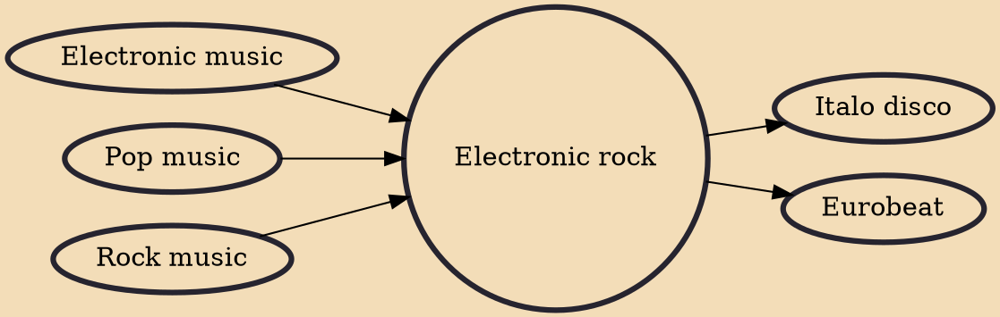

Electronic rock is a music genre that involves a combination of rock music and electronic music, featuring instruments typically found within both genres. It originates from the late 1960s, when rock bands began incorporating electronic instrumentation into their music. Electronic rock acts usually fuse elements from other music styles, including punk rock, industrial rock, hip hop, techno, and synth-pop, which has helped spur subgenres such as indietronica, dance-punk, and electroclash.

## Influences

- [[Electronic music]]
- [[Pop music]]
- [[Rock music]]

## Derivatives

- [[Italo disco]]
- [[Eurobeat]]
