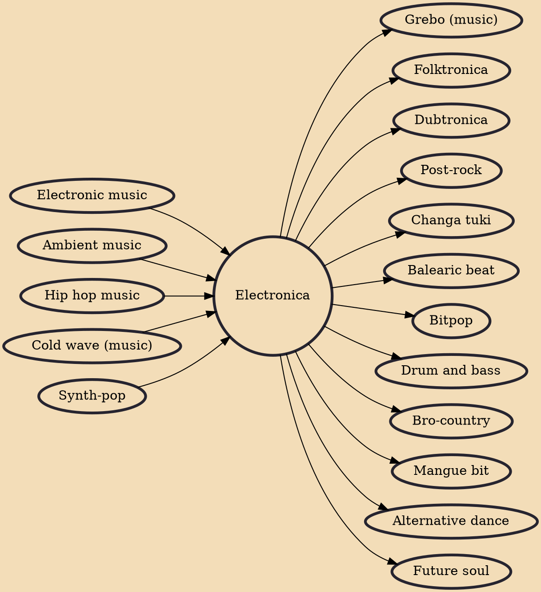

Electronica is both a broad group of electronic-based music styles intended for listening rather than strictly for dancing and a music scene that started in the early 1990s in the United Kingdom. In the United States, the term is mostly used to refer to electronic music generally.

## Influences
- [[Electronic music]]
- [[Ambient music]]
- [[Hip hop music]]
- [[Cold wave (music)]]
- [[Synth-pop]]

## Derivatives
- [[Grebo (music)]]
- [[Folktronica]]
- [[Dubtronica]]
- [[Post-rock]]
- [[Changa tuki]]
- [[Balearic beat]]
- [[Bitpop]]
- [[Drum and bass]]
- [[Bro-country]]
- [[Mangue bit]]
- [[Alternative dance]]
- [[Future soul]]
