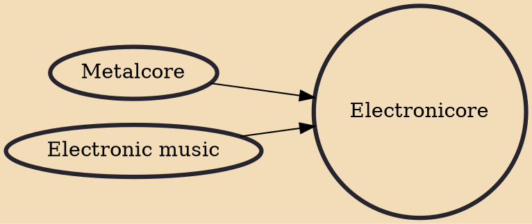

Electronicore (also known as synthcore or trancecore) is a fusion genre of metalcore with elements of various electronic music genres, often including trance, electronica, and dubstep.

## Influences

- [[Metalcore]]
- [[Electronic music]]
