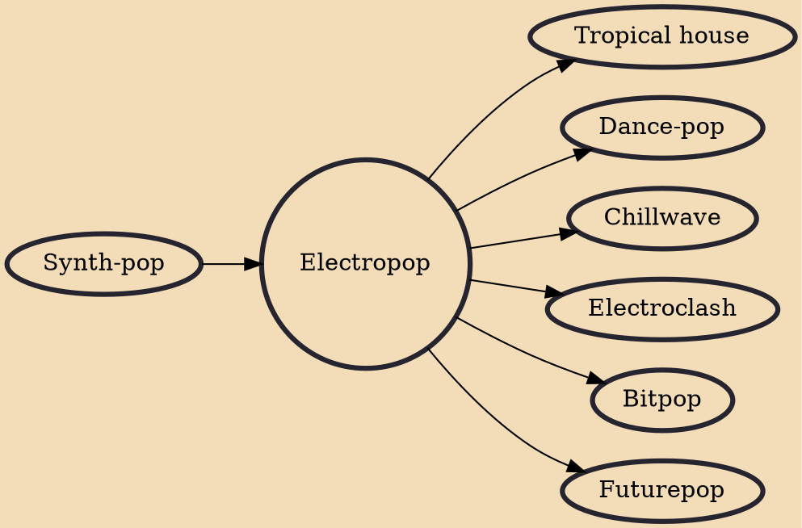

Electropop is a hybrid music genre combining elements of electronic and pop genres. Writer Hollin Jones has described it as a variant of synth-pop with heavy emphasis on its electronic sound. The genre was developed in the 1980s and saw a revival of popularity and influence in the late 2000s.

## Influences

- [[Synth-pop]]

## Derivatives

- [[Tropical house]]
- [[Dance-pop]]
- [[Chillwave]]
- [[Electroclash]]
- [[Bitpop]]
- [[Futurepop]]
