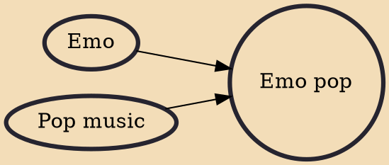

Emo pop (also known as emo pop punk and pop-emo) is a fusion genre combining emo with the melodies of pop punk and/or pop music. Emo pop features a music style with more concise songs and hook-filled choruses. Emo pop began in the 1990s with bands like Jimmy Eat World, the Get Up Kids, Weezer and the Promise Ring. The genre became mainstream in the early 2000s with Jimmy Eat World's album Bleed American, including the album's song "The Middle". In the 2000s, other emo pop bands that achieved mainstream success included Fall Out Boy, the All-American Rejects, My Chemical Romance, Panic! at the Disco and Paramore. The popularity of emo pop declined in the 2010s, with some prominent artists in the genre either disbanding or abandoning the emo pop style.

## Influences

- [[Emo]]
- [[Pop music]]
