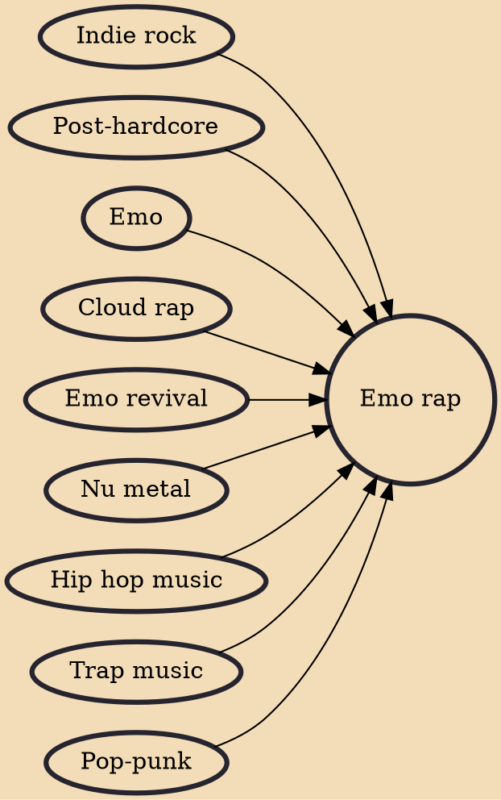

Emo rap is a fusion genre of hip hop and emo music. Originating in the SoundCloud rap scene in the mid-2010s, the genre fuses characteristics of hip hop music, such as beats and rapping, with the lyrical themes, instrumentals, and vocals commonly found in emo music. Lil Peep, XXXTentacion, and Juice Wrld are some of the most notable musicians in the genre.

## Influences

- [[Indie rock]]
- [[Post-hardcore]]
- [[Emo]]
- [[Cloud rap]]
- [[Emo revival]]
- [[Nu metal]]
- [[Hip hop music]]
- [[Trap music]]
- [[Pop-punk]]
