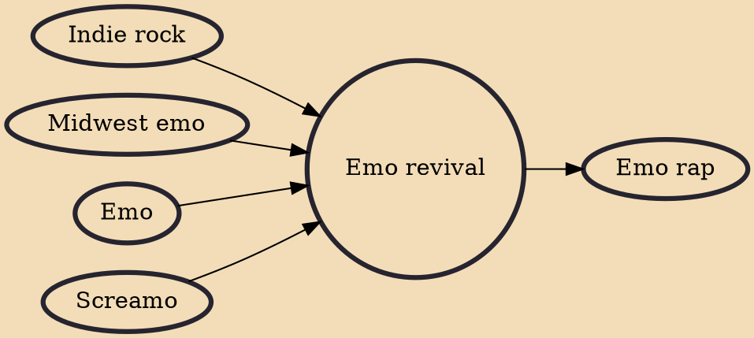

The emo revival (also known as the post-emo revival, the Midwestern emo revival, and fourth wave emo) was an underground emo movement which came about in the late 2000s to early 2010s. Groups of the emo revival largely abandon the style of the mainstream emo acts of the mid 2000s in favor of a style influenced by 1990s emo acts. The revival had largely dissolved by the mid 2010s.

## Influences

- [[Indie rock]]
- [[Midwest emo]]
- [[Emo]]
- [[Screamo]]

## Derivatives

- [[Emo rap]]
