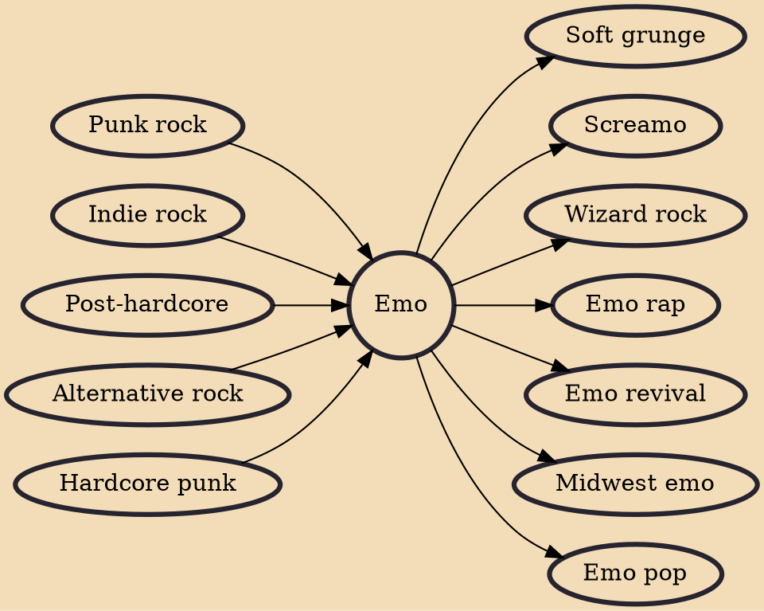

Emo /ˈiːmoʊ/ is a rock music genre characterized by emotional, often confessional lyrics. It emerged as a style of post-hardcore and hardcore punk from the mid-1980s Washington D.C. hardcore punk scene, where it was known as emotional hardcore or emocore and pioneered by bands such as Rites of Spring and Embrace. In the early–mid 1990s, emo was adopted and reinvented by alternative rock, indie rock and/or punk rock bands such as Sunny Day Real Estate, Jawbreaker, Weezer, Cap'n Jazz, and Jimmy Eat World. By the mid-1990s, bands such as Braid, the Promise Ring, and the Get Up Kids emerged from the burgeoning Midwest emo scene, and several independent record labels began to specialize in the genre. Meanwhile, screamo, a more aggressive style of emo using screamed vocals, also emerged, pioneer

## Influences

- [[Punk rock]]
- [[Indie rock]]
- [[Post-hardcore]]
- [[Alternative rock]]
- [[Hardcore punk]]

## Derivatives

- [[Soft grunge]]
- [[Screamo]]
- [[Wizard rock]]
- [[Emo rap]]
- [[Emo revival]]
- [[Midwest emo]]
- [[Emo pop]]
