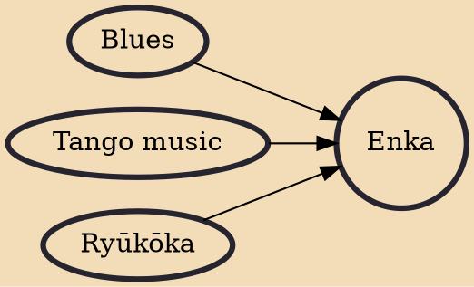

Enka (演歌) is a Japanese music genre considered to resemble traditional Japanese music stylistically. Modern enka, however, is a relatively recent musical form, which adopts a more traditional musical style in its vocalism than ryūkōka music, popular during the prewar years.

## Influences

- [[Blues]]
- [[Tango music]]
- [[Ryūkōka]]
