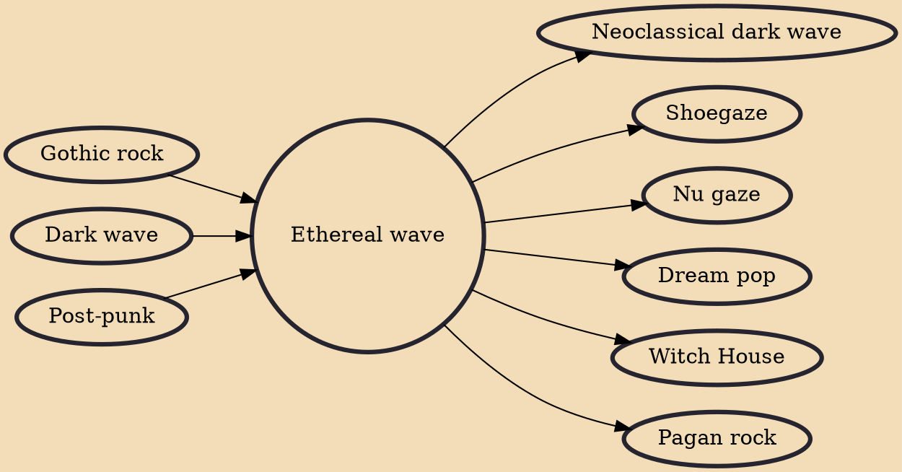

Ethereal wave, also called ethereal darkwave, ethereal goth or simply ethereal, is a subgenre of dark wave music that is variously described as "gothic", "romantic", and "otherworldly". Developed in the early 1980s in the UK as an outgrowth of gothic rock, ethereal wave was mainly represented by 4AD bands such as Cocteau Twins, This Mortal Coil, and early guitar-driven Dead Can Dance. Ethereal wave, especially the music of Cocteau Twins, was one of the key inspirations for the British dream pop/shoegazing scene of the late 1980s and early 1990s.

## Influences

- [[Gothic rock]]
- [[Dark wave]]
- [[Post-punk]]

## Derivatives

- [[Neoclassical dark wave]]
- [[Shoegaze]]
- [[Nu gaze]]
- [[Dream pop]]
- [[Witch House]]
- [[Pagan rock]]
