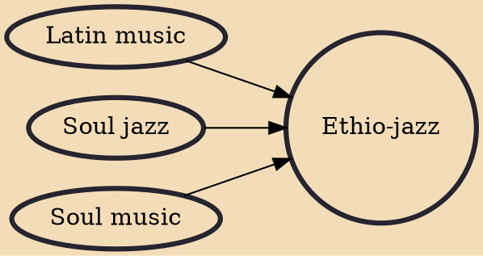

Ethio-jazz is a blend of jazz music with traditional Ethiopian music, combining the pentatonic scale-based melodies of Ethiopian music with the 12-tone scale and instrumentation of Western jazz music. Other elements in this genre include Afrofunk, soul, and Latin rhythms. The genre originated in the 1950s with Armenian musician , who created a fusion of Ethiopian and Western music while working at the National Theatre. Ethio-jazz was revolutionized by Mulatu Astatke in the late 1950s. Astatke is considered the father of Ethio-jazz music.

## Influences
- [[Latin music]]
- [[Soul jazz]]
- [[Soul music]]
