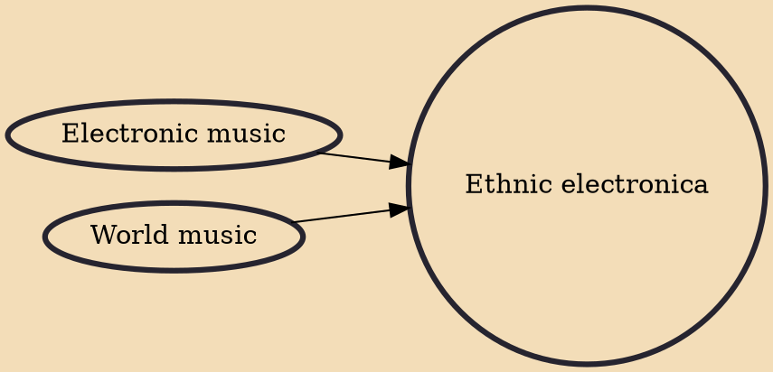

Ethnic electronica (also known as ethnotronica, ethno electronica or ethno techno) is a broad category of electronic music, where artists combine elements of electronic and world music. The music is primarily rooted in local music traditions and regional cultures, rarely relying on global trends of popular music.

## Influences

- [[Electronic music]]
- [[World music]]
