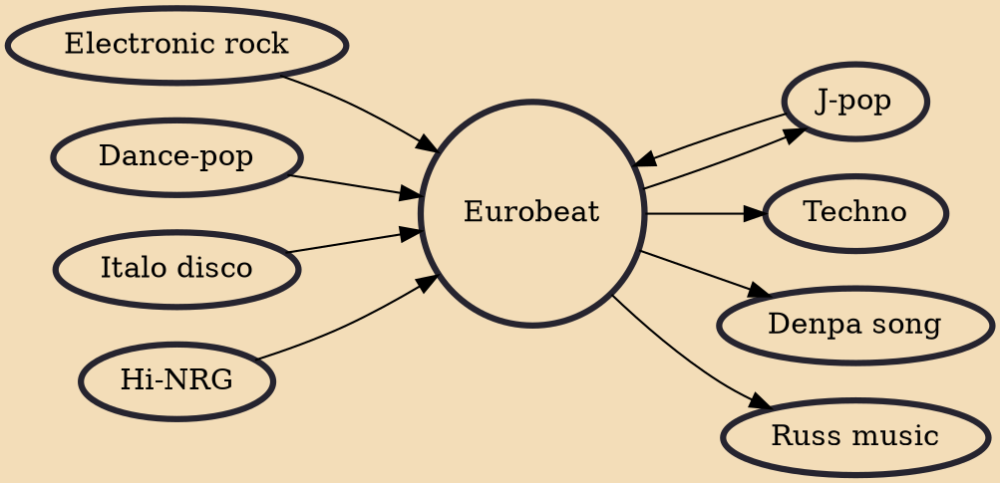

Eurobeat refers to two styles of dance music that originated in Europe: one is a British variant of Italian Eurodisco-influenced dance-pop, and the other is a hi-NRG-driven form of Italo disco. Both forms were developed in the 1980s. Producer trio Stock Aitken Waterman and pop band Dead or Alive made Eurobeat music more popular in the United States, where Eurobeat was historically marketed as hi-NRG (pronounced as "high energy"). For a short while, it also shared this term with early freestyle music and Italo disco.

## Influences

- [[Electronic rock]]
- [[J-pop]]
- [[Dance-pop]]
- [[Italo disco]]
- [[Hi-NRG]]

## Derivatives

- [[Techno]]
- [[Denpa song]]
- [[Russ music]]
- [[J-pop]]
