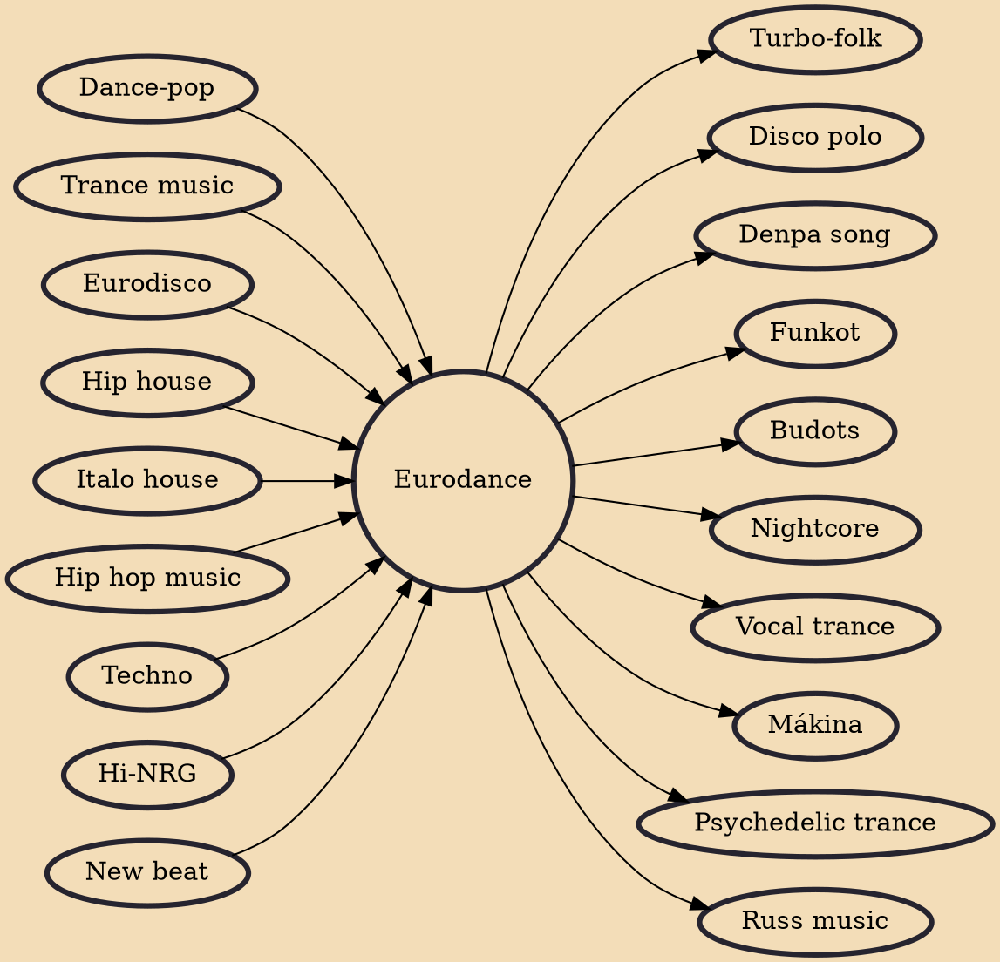

Eurodance (sometimes referred to as Euro-NRG, Euro-electronica or Euro) is a genre of electronic dance music that originated in the late 1980s in Europe. It combines many elements of hip hop, techno, Hi-NRG, house music, and Euro disco. This genre of music is heavily influenced by the use of rich vocals, sometimes with rapped verses. This, combined with cutting-edge synthesizers, strong bass rhythm and melodic hooks, establishes the core foundation of Eurodance music.

## Influences
- [[Dance-pop]]
- [[Trance music]]
- [[Eurodisco]]
- [[Hip house]]
- [[Italo house]]
- [[Hip hop music]]
- [[Techno]]
- [[Hi-NRG]]
- [[New beat]]

## Derivatives
- [[Turbo-folk]]
- [[Disco polo]]
- [[Denpa song]]
- [[Funkot]]
- [[Budots]]
- [[Nightcore]]
- [[Vocal trance]]
- [[Mákina]]
- [[Psychedelic trance]]
- [[Russ music]]
