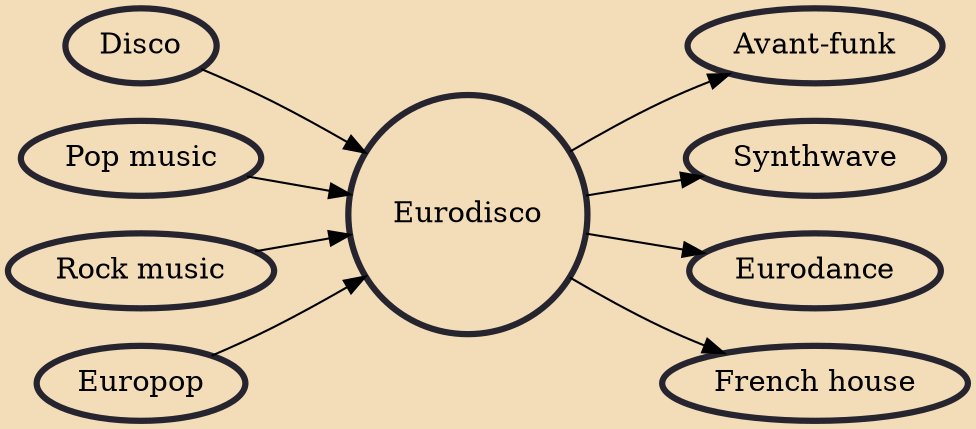

Eurodisco (also spelled as Euro disco) is the variety of European forms of electronic dance music that evolved from disco in the late 1970s, incorporating elements of pop and rock into a disco-like continuous dance atmosphere. Many Eurodisco compositions feature lyrics sung in English, although the singers often share a different mother tongue.

## Influences

- [[Disco]]
- [[Pop music]]
- [[Rock music]]
- [[Europop]]

## Derivatives

- [[Avant-funk]]
- [[Synthwave]]
- [[Eurodance]]
- [[French house]]
