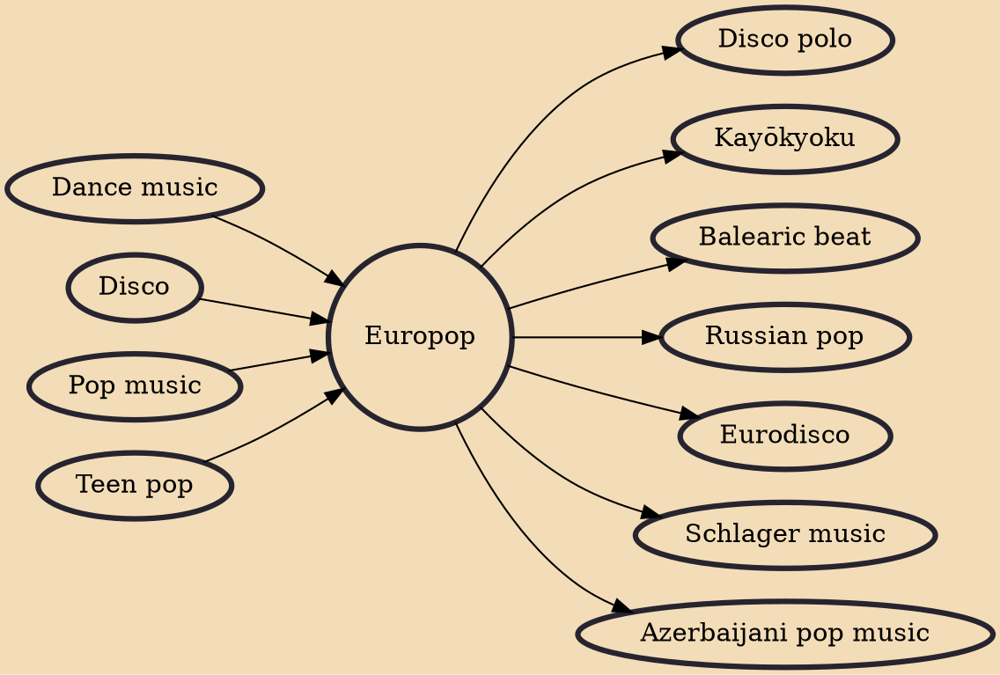

Europop (also spelled Euro pop) is a style of pop music that originated in Europe during the mid-to-late 1960s and developed to today's form throughout the late 1970s. Europop topped the charts throughout the 1980s and 1990s, with revivals and moderate degrees of appreciation also in the 2000s and the 2010s.

## Influences
- [[Dance music]]
- [[Disco]]
- [[Pop music]]
- [[Teen pop]]

## Derivatives
- [[Disco polo]]
- [[Kayōkyoku]]
- [[Balearic beat]]
- [[Russian pop]]
- [[Eurodisco]]
- [[Schlager music]]
- [[Azerbaijani pop music]]
