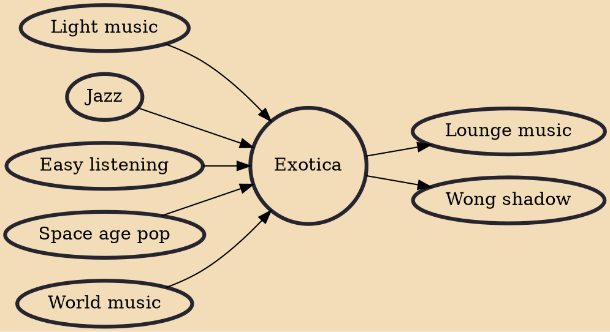

Exotica is a musical genre, named after the 1957 Martin Denny album of the same name that was popular during the 1950s to mid-1960s with Americans who came of age during World War II. The term was coined by Simon "Si" Waronker, Liberty Records co-founder board chairman. The musical colloquialism exotica means tropical ersatz, the non-native, pseudo experience of insular Oceania, Southeast Asia, Hawaii, the Amazon basin, the Andes, the Caribbean and tribal Africa. Denny described the musical style as "a combination of the South Pacific and the Orient...what a lot of people imagined the islands to be like...it's pure fantasy though." While the South Seas forms the core region, exotica reflects the "musical impressions" of every place from standard travel destinations to the mythical "shangri

## Influences

- [[Light music]]
- [[Jazz]]
- [[Easy listening]]
- [[Space age pop]]
- [[World music]]

## Derivatives

- [[Lounge music]]
- [[Wong shadow]]
