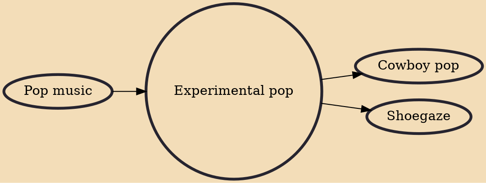

Experimental pop is pop music that cannot be categorized within traditional musical boundaries or which attempts to push elements of existing popular forms into new areas. It may incorporate experimental techniques such as musique concrète, aleatoric music, or eclecticism into pop contexts. Often, the compositional process involves the use of electronic production effects to manipulate sounds and arrangements, and the composer may draw the listener's attention specifically with both timbre and tonality, though not always simultaneously.

## Influences

- [[Pop music]]

## Derivatives

- [[Cowboy pop]]
- [[Shoegaze]]
