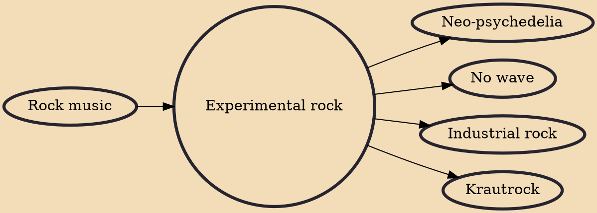

Experimental rock, also called avant-rock, is a subgenre of rock music that pushes the boundaries of common composition and performance technique or which experiments with the basic elements of the genre. Artists aim to liberate and innovate, with some of the genre's distinguishing characteristics being improvisational performances, avant-garde influences, odd instrumentation, opaque lyrics (or instrumentals), unorthodox structures and rhythms, and an underlying rejection of commercial aspirations.

## Influences

- [[Rock music]]

## Derivatives

- [[Neo-psychedelia]]
- [[No wave]]
- [[Industrial rock]]
- [[Krautrock]]
