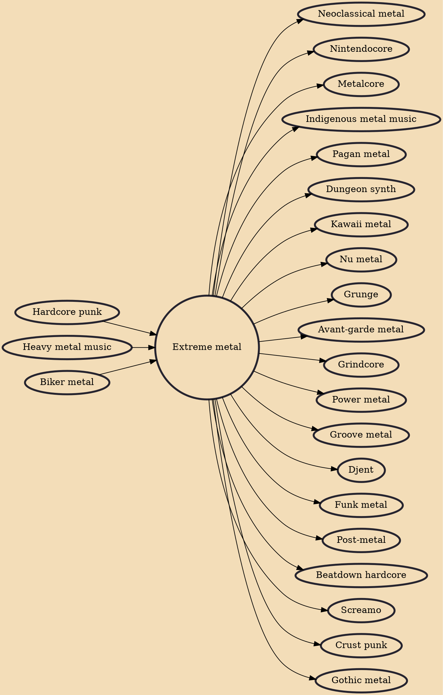

Extreme metal is a loosely defined umbrella term for a number of related heavy metal music subgenres that have developed since the early 1980s. It has been defined as a "cluster of metal subgenres characterized by sonic, verbal, and visual transgression".

## Influences
- [[Hardcore punk]]
- [[Heavy metal music]]
- [[Biker metal]]

## Derivatives
- [[Neoclassical metal]]
- [[Nintendocore]]
- [[Metalcore]]
- [[Indigenous metal music]]
- [[Pagan metal]]
- [[Dungeon synth]]
- [[Kawaii metal]]
- [[Nu metal]]
- [[Grunge]]
- [[Avant-garde metal]]
- [[Grindcore]]
- [[Power metal]]
- [[Groove metal]]
- [[Djent]]
- [[Funk metal]]
- [[Post-metal]]
- [[Beatdown hardcore]]
- [[Screamo]]
- [[Crust punk]]
- [[Gothic metal]]
