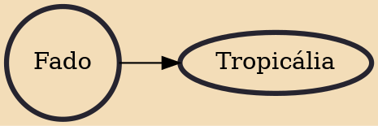

Fado (Portuguese pronunciation: [ˈfaðu]; "destiny, fate") is a music genre that can be traced to the 1820s in Lisbon, Portugal, but probably has much earlier origins. Fado historian and scholar Rui Vieira Nery states that "the only reliable information on the history of fado was orally transmitted and goes back to the 1820s and 1830s at best. But even that information was frequently modified within the generational transmission process that made it reach us today."

## Derivatives
- [[Tropicália]]
